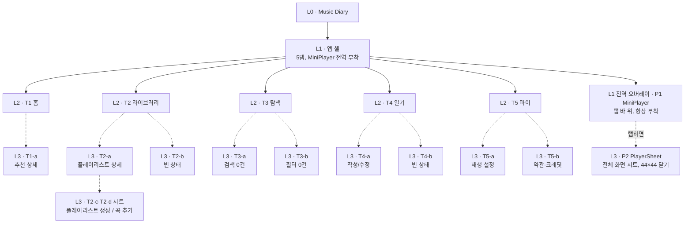

# 20. 설계 — IA · 유저 플로우 · 와이어프레임 (Music Diary)

작성 2026-08-07 · 근거 문서 [08 콘셉트 확정](../Eng/08-concept-music-diary.md) ·
[09 구현 명세](09-implementation-spec.md) · [11 컴포넌트 패턴 조사](11-component-patterns-research.md)
범위 — **구조만**(색·타이포·이미지는 Srit이 Figma에서 직접 결정) · 표기 —
`08 §MVP scope` = 08의 MVP scope 절, `[판단]`은 08·09·11에 없는 설계 결정

## 0-1. 근거 체계가 냥BTI와 다른 이유

냥BTI의 `04-design.md`는 페르소나·공감지도·고객여정지도(01–03) 각 절을 화면마다
직접 인용한다. Music Diary는 그 파이프라인 문서(01–03에 해당하는 페르소나·여정지도)가
**team-project 저장소에 없다** — 팀원이 콘셉트를 별도로 설계했고 `08`이 그 결과를
확정한 문서다. 따라서 이 문서의 근거는 페르소나 원문이 아니라 **08의 제품 결정과
09의 구현 명세, 11의 컴포넌트 조사**다. 이 차이를 숨기지 않고 여기 적어 둔다.

## 0-2. 확정 전제 (재논의 대상 아님)

- **탭 5개 고정** — 홈 · 라이브러리 · 탐색 · 일기 · 마이. 냥BTI처럼 셸 밖 선형
  플로우가 없다 — Music Diary는 처음부터 셸 안에서 시작한다 (`08 §MVP scope`)
- **MiniPlayer는 전역** — `App.jsx`에 마운트, 모든 탭에서 동일 상태·동일 위치.
  탭 소유가 아니다 (`09 §6`)
- **PlayerSheet는 shadcn `Sheet`** (Radix Dialog 기반), **`Drawer` 아님** —
  이 프로젝트는 제스처 전면 금지이고 `Drawer`는 `vaul` 의존이라 스와이프·드래그
  핸들이 기본이다 (`09 §6`, `11 §0`)
- **뎁스 2가 적정, 3을 넘기지 않는다.** 라이브러리 → 플레이리스트 상세는
  **더보기 중간 화면 없이 바로** 간다 (`08 §뎁스 주의`)
- **가로 스크롤 금지** — 기분 칩 5개는 항상 전부 노출, 안 들어가면 2줄 줄바꿈
  (`11 §0` sol 검토 정정)
- **제스처 전부 금지** — 스와이프·롱프레스·드래그 정렬. 플레이리스트 순서 변경도
  위/아래 버튼 (`08 §걷어낸 것`, `09 §8`)
- **계정·프로필·로그인 없음** — 마이 탭의 아이콘은 계정 기능으로 이어지지 않는다
  (`08 §걷어낸 것`)

## 0-3. 기분 기반 전역 테마 — 구조 (2026-08-07 확정, 같은 날 저녁 두 차례 정정)

**색상 값 자체는 Srit이 Figma에서 정한다.** 여기 적는 것은 그 색이 **언제·어디서
나타나는가**라는 구조 규칙이다 — 이건 컴포넌트 설계에 영향을 주므로 이 문서 범위다.

**2차 정정 (레퍼런스 이미지 기반, 2026-08-07 밤)** — "상단 40~50% 워시, 아래는 흰
배경 그대로"는 폐기. 실제로 정한 것은 **풀블리드 채도 높은 그라디언트**다 —
온보딩 카드류 레퍼런스처럼 콘텐츠 영역 전체가 그 기분 색 그라디언트로 덮인다.

- **기본 상태 = 흰 배경.** 활성 기분이 없으면(앱 최초 진입, 라이브러리, 마이 탭,
  필터 없는 목록) 배경은 순수 흰색, 카드·텍스트는 지금까지 만든 회색 상자 스타일
  그대로(ink 텍스트, 무채색 아이콘) — **재도색 불필요**
- **활성 기분 = content 영역 전체를 덮는 풀블리드 그라디언트.** 상태바 바로 아래부터
  NavFooter/MiniPlayer 앞까지, **화면의 콘텐츠 영역 전체**가 그 기분 색 그라디언트로
  채워진다 — 상단 40~50%에서 흰색으로 사라지는 워시가 아니라, 화면을 채우는 배경이다
- **그라디언트 위 콘텐츠는 라이트 스타일로 전환된다.** 채도 높은 배경 위에서는 ink
  텍스트가 대비를 잃으므로, 그라디언트가 활성일 때 제목·본문·TrackRow/DiaryCard의
  텍스트는 **흰색/밝은 색**으로 바뀌고, 아트워크 placeholder 같은 회색 박스는 **반투명
  흰색(frosted) 박스**로 바뀐다 — 레퍼런스의 반투명 아이콘 컨테이너와 같은 처리
- **NavFooter·MiniPlayer는 여전히 중립(흰 배경 anchor)로 남는다.** 그라디언트는
  콘텐츠 영역에서 끝나고, 화면 하단의 재생바·탭바는 항상 흰 배경 위 ink 스타일을
  유지한다 — 기분이 아무리 바뀌어도 조작 가능한 하단 UI는 안정적으로 같은 자리에
  같은 모습으로 있어야 한다는 원칙은 유지
- **선택된 기분 칩과 DiaryCard 배지**는 그라디언트 위에서는 반투명 흰색 배경 +
  진한 텍스트로, 그라디언트가 없는 기본 상태에서는 이전처럼 옅은 기분색 틴트로
  표시한다 — 두 상태 모두에서 "이게 선택된 기분"이라는 신호는 유지하되 배경에 맞게
  뒤집힌다(light-on-color ↔ color-on-white)
- **전환은 애니메이션** — 그라디언트가 나타날 때 페이드/그로우로 등장한다. **Figma
  회색 상자는 정적이므로, 활성 상태는 별도 프레임(예: "T1 · 홈 (기분 활성 예시)")으로
  스냅샷 하나만 보여준다.** 실제 트랜지션 타이밍은 코딩 단계에서 정한다
- **활성 기분의 우선순위 (`[판단]`, 08·09·11에 없음)**
  1. **재생 중인 곡의 기분 태그** — `Track.moods` 배열의 첫 값. MiniPlayer는 모든
     화면에 떠 있는 가장 전역적인 상태이므로 최우선
  2. 재생 중이 아니면 **현재 화면에서 선택된 기분** — 홈·탐색의 기분 칩 선택,
     일기 작성 화면(T4-a)에서 고르는 감정 얼굴
  3. 둘 다 없으면 **활성 기분 없음** → 흰 배경 기본 상태 (위 참조)
  - 곡이 재생 중이고 화면에서 다른 기분을 골라도 1번이 이긴다 — 이 우선순위는
    나중에 뒤집힐 수 있는 판단이지 08·09·11에서 나온 규칙이 아니다
- **secondary(Slate)는 여전히 고정** — 워시가 있든 없든 보조 버튼·링·구분선은
  Slate를 그대로 쓴다. 그라디언트는 배경 레이어일 뿐 컴포넌트 토큰을 바꾸지 않는다
- 그라디언트의 정확한 불투명도·높이 비율·이징은 다음 단계(Figma 실사용, 코딩)에서
  Srit이 정한다. 이 절은 "무엇이 어디서 나타나는가"만 고정한다
- **`08`의 "테마는 하나뿐, 전환 기능 없음"과 충돌하지 않는다** — 그 문장은 마이
  탭에 사용자가 고르는 테마 스위처를 두지 않는다는 뜻이다. 여기서 말하는 리틴트는
  사용자가 켜고 끄는 기능이 아니라 기분 컨텍스트에 따라 자동으로 따라가는 색이므로
  별개다

## 0-4. 색상 값 — Srit 확정 (2026-08-07)

출처는 [Radix Colors](https://www.radix-ui.com/colors)(MIT) — 조사 근거·다른 후보군
비교는 `/private/tmp/.../scratchpad/musicdiary-colors/research.md`(세션 스크래치패드,
저장소 밖). 여기 적힌 hex는 Radix 공식 CSS에서 그대로 복사한 값이다.

| MoodId | 라벨 | Radix family | step 9 (solid) | 위에 올릴 텍스트 |
| --- | --- | --- | --- | --- |
| — (secondary, 고정) | — | Slate | `#d9d9e0`(step 6, 배경용) / `#1c2024`(step 12, 텍스트용) | — |
| `calm` | 차분함 | **Mint** | `#86ead4` | **어두운색** — Radix가 명시한 예외 |
| `flutter` | 설렘 | **Pink** (2026-08-07 밤, Tomato에서 교체 — "설렘엔 핑크가 더 맞다") | `#d6409f` | 흰색 |
| `comfort` | 위로 | **Amber** | `#ffc53d` | **어두운색** — Radix가 명시한 예외 |
| `focus` | 집중 | **Blue** | `#0090ff` | 흰색 |
| `longing` | 그리움 | **Iris** | `#5b5bd6` | 흰색 |

- **Pink 값 확인 완료 (2026-08-07 밤)** — `@radix-ui/colors` 공식 CSS(`pink.css`)를
  직접 대조해 `#d6409f`가 정확히 `--pink-9`임을 확인했다. 나머지 4색과 동일한
  신뢰도. Pink는 Radix가 명시한 다크텍스트 예외(Sky/Mint/Lime/Yellow/Amber)에
  포함되지 않으므로 흰 텍스트가 원칙 — 단, Figma 데모의 옅은 파스텔 버전은 배경
  자체를 밝게 눌러 톤을 낮췄기 때문에 그 특정 데모에서만 예외적으로 어두운 텍스트를
  썼다(§0-3 톤 조정, Srit 요청)

- **매핑 확정 (2026-08-07, Srit)** — 근거는 관례적 색-감정 연상(민트=차분,
  토마토=설렘의 활기, 앰버=위로의 온기, 블루=집중의 관례색, 아이리스=그리움의
  황혼감)이며 `08`·`09`·`11` 어디에도 없는 판단이다 (`[판단]`). Figma에서 실제
  화면에 올려보고 어색하면 아래 두 조합으로 바꿔볼 것 — **위로↔설렘**
  (Amber↔Tomato, 둘 다 warm 계열) 또는 **차분함↔그리움** (Mint↔Iris, 둘 다
  cool 계열). 매핑을 바꿔도 다섯 hex 값 자체는 바뀌지 않는다
- **Amber·Mint는 밝은 step 9라 어두운 텍스트가 필요하다.** Tomato·Blue·Iris는
  흰 텍스트. 컴포넌트가 mood별로 텍스트 색까지 같이 바꿔야 한다는 뜻이므로,
  `primary-foreground` 토큰도 mood 전환 때 같이 스왑해야 한다 (`0-3` 구조 규칙에
  텍스트 색 스왑까지는 명시가 안 돼 있었음 — 여기서 보강)
- Tomato는 Warm Vinyl 덱 악센트(`#C1502E`)와 계열은 같지만 값은 다르다 — 덱과
  앱을 색으로 직접 잇고 싶다면 Tomato를 의도적으로 고른 것으로 볼 수 있다

## 1. 화면 목록과 근거 추적

| ID | 화면 | 레벨 | 근거 | 성격 |
| --- | --- | --- | --- | --- |
| T1 | 홈 (탭) | L2 | `08 §MVP scope` 기분 선택 5개→추천→최근재생 | destination |
| T1-a | 오늘의 추천 상세 | L3 drill-down | `08 §뎁스 주의` 예시 2뎁스 ✓ | drill-down |
| T2 | 라이브러리 (탭) | L2 | `08 §MVP scope` 업로드·좋아요·최근재생·내 플레이리스트 | destination |
| T2-a | 플레이리스트 상세 | L3 drill-down | `08 §뎁스 주의` — 더보기 화면 없이 바로 진입, 2뎁스 유지 | drill-down |
| T2-b | 라이브러리 빈 상태 | L3 상태 | `11 §7` EmptyState 구조 | 빈 상태 |
| T2-c | 플레이리스트 생성 시트 | L3 시트 | `09 §6` Sheet만 사용, 44×44 닫기 | action |
| T2-d | 곡을 플레이리스트에 추가 시트 | L3 시트 | `09 §3` playlists.addTracks | action |
| T3 | 탐색 (탭) | L2 | `08 §MVP scope` 검색·분위기별 모아보기 | destination |
| T3-a | 검색 결과 0건 | L3 상태 | `11 §7` "다른 검색어를 입력해 보세요" | 빈 상태 |
| T3-b | 분위기 필터 결과 0건 | L3 상태 | `11 §7` "이 분위기의 곡이 아직 없어요" | 빈 상태 |
| T4 | 일기 (탭) | L2 | `08 §MVP scope` 날짜별 히스토리 | destination |
| T4-a | 일기 작성/수정 | L3 drill-down `[판단]` | `08 §MVP scope` 일기 작성(음악 연결), 화면 형태는 09에 미명시 | drill-down |
| T4-b | 일기 빈 상태 | L3 상태 | `11 §7` "오늘의 기분을 남겨 보세요" | 빈 상태 |
| T5 | 마이 (탭) | L2 | `08 §MVP scope` 취향·재생설정·알림·테마·약관 | destination |
| T5-a | 재생 설정 상세 | L3 drill-down | `08 §뎁스 주의` 예시 2뎁스 ✓, `08 §남기는 재생 설정` | drill-down |
| T5-b | 이용약관 (크레딧은 화면에서 제외, 2026-08-07 밤 정정) | L3 drill-down | `08 §content problem` — 크레딧은 저장소 README/CREDITS.md로 이동, 화면은 이용약관만 | drill-down |
| P1 | MiniPlayer | L1 전역 오버레이 | `09 §6`, `11 §2` | 전역 상태 |
| P2 | PlayerSheet (전체화면 플레이어) | L3 시트 | `09 §6`, `11 §3` | action/상태 |

- **T4-a만 09에 화면 형태가 명시되지 않은 항목** — 08은 "일기 작성(음악 연결)"이라고만
  하고 시트인지 전체 화면인지 정하지 않았다. 텍스트 입력 + 기분 선택 + 곡 선택이
  한 화면에 들어가므로 **전체 화면 drill-down으로 판단**했다 (시트는 좁아서 세
  입력을 다 담기 어렵다). Figma 단계에서 바뀔 수 있는 유일한 항목
- 플레이리스트 순서 변경(위/아래 버튼)은 T2-a 내부의 **편집 모드 상태**이지 별도
  화면이 아니다 (`09 §8` 드래그 핸들 금지)
- 곡 업로드는 네이티브 파일 선택 대화상자를 그대로 쓴다 — 앱이 그리는 화면이 아니다

## 2. IA 구조도

범례 — 실선 화살표: L1→L2 탭 진입. 점선 화살표: L2→L3 drill-down/시트/오버레이.



- **P1·P2는 5개 destination 어디에서도 같은 상태로 뜬다** — 특정 탭 소유가 아니므로
  조직도의 별도 가지로 그린다 (`09 §6`)
- **T2-a는 T2에서 바로 나가는 화살표만 받는다** — 08의 뎁스 주의를 지키기 위해
  "내 플레이리스트 더보기" 같은 중간 목록 화면을 만들지 않는다
- 냥BTI와 달리 **셸 밖 Z1 영역이 없다** — 모든 화면이 처음부터 탭 바 안에 있다

## 3. 화면별 구조 노트

와이어프레임은 회색 상자(grey-box)로 Figma에 옮긴다. 아래는 그 상자 배치의 근거다.

### T1 홈

```
[상태바]
분위기 칩 5개 (2줄까지 허용, 스크롤 없음)         — 11 §6
오늘의 추천 — TrackRow 1~3개                      — 11 §4
최근 재생 — TrackRow 가로 또는 세로 목록          — 11 §4
[MiniPlayer — 재생 중일 때만]
[NavFooter]
```

- 기분 칩 선택 시 홈 안에서 추천 목록만 갱신 — 별도 화면 전환 없음
- 추천 트랙 탭 → 재생 시작(P1 등장) 또는 T1-a 상세로 진입(`[판단]`, 08에 상세 화면
  내용 명시 없음 — 재생과 상세 보기 두 액션을 어떻게 나눌지는 Figma에서 확정)

### T2 라이브러리

```
[상태바]
필터 줄 — 전체 / 좋아요 / 최근재생 (shadcn tabs, 하단 5탭과 다른 용도)  — 09 §6
TrackRow 목록 (72px, 48px artwork)                — 11 §4
내 플레이리스트 — PlaylistRow 목록 + "만들기" 버튼  — 08 §되살린 것
[MiniPlayer][NavFooter]
```

- 플레이리스트 행 탭 → T2-a로 즉시 이동 (더보기 화면 생략)
- 0곡이면 본문 전체가 T2-b(EmptyState)로 대체 — 필터 줄까지 숨긴다

### T2-a 플레이리스트 상세

```
헤더 — 이름, 뒤로가기(44×44)
TrackRow 목록, 편집 모드에서 각 행에 ↑↓ 버튼(제스처 금지)  — 09 §8
"곡 추가" → T2-d 시트
[MiniPlayer][NavFooter 유지 — 탭 셸 내부 drill-down]
```

### T3 탐색

```
[상태바]
검색 입력창 (44px 이상, 16px 이상 폰트)           — 09 §7
분위기 칩 5개 (T1과 동일 컴포넌트, 값 공유)        — 08 §기분 어휘
결과 — TrackRow 목록
[MiniPlayer][NavFooter]
```

- 검색어와 분위기 칩은 동시에 적용되는 필터 — 검색 0건과 필터 0건은 문구만 다른
  같은 EmptyState 컴포넌트(T3-a / T3-b)

### T4 일기

```
[상태바]
날짜별 DiaryCard 목록 (최신순)                     — 11 §8
"오늘 일기 쓰기" 플로팅 또는 상단 버튼
[MiniPlayer][NavFooter]
```

- 오늘 날짜에 이미 항목이 있으면 버튼 라벨이 "오늘 일기 수정"으로 바뀐다
  (`08 §Data contract` 하루 한 건, upsert)
- 0건이면 본문이 T4-b(EmptyState)로 대체

### T4-a 일기 작성/수정

```
헤더 — 날짜, 뒤로가기(44×44)
기분 얼굴 5개 (단일 선택, T1 칩과 값 공유·표현만 다름)  — 08 §기분 어휘
텍스트 입력
연결할 곡 — 현재 재생 중인 곡 자동 후보 + TrackRow 선택
저장 버튼 (하단 고정, 44px 이상)
```

### T5 마이

```
[상태바]
카드 그룹 (음악 취향 요약 + 설정 목록, top-align)
  음악 취향 요약 — 정적 텍스트/통계, drill-down 없음 (`[판단]`)
  재생 설정 → T5-a
  알림 → 인라인 토글 (09 §8, 인앱 알림만)
  테마 → 인라인 토글, 자동(기분별 그라디언트) / 꺼기(항상 흰색) (2026-08-07 정정,
    아래 참고)
  이용약관 → T5-b
앱 정보 푸터 — "Music Diary · v0.1.0" 정적 텍스트, bottom-align (2026-08-07 추가,
  아래 참고)
[MiniPlayer][NavFooter]
```

- **정정 (2026-08-07)** — "테마 → 정적 표시, 전환 기능 없음" 문구는 폐기. 원래는
  §0-4에서 확정한 "테마는 하나뿐"(디자인 스킨이 하나뿐이라는 뜻)을 가리켰는데,
  이후 §0-3에서 기분 기반 전역 그라디언트 테마가 확정되면서 문맥이 바뀌었다.
  실제로 필요한 것은 이 그라디언트 연출을 켜고 끄는 스위치이므로 "자동/꺼기"
  2단 토글로 바꾼다. 화면 하단 공백을 메우려고 만든 게 아니라 실제로 빠져 있던
  설정이었다 — `Warm Vinyl` 같은 스킨 이름은 애초에 근거 없는 placeholder였다
- **레이아웃 정정 (2026-08-07, 두 차례)** — 처음엔 `content` 프레임을
  top-align → vertical-center로 바꿨으나, 두 카드만 가운데 두면 위아래 여백이
  둘 다 커서 "여전히 공간이 크다"는 재확인을 받았다. 최종적으로 두 카드를
  `카드 그룹` 서브프레임으로 묶어 top-align 유지, `content`는 SPACE_BETWEEN으로
  바꿔 카드 그룹은 위에, 앱 정보 푸터(아래 항목)는 아래에 고정 — 남는 공간이
  중간 한 곳으로 모이게 했다. 마이 탭은 08/09에서 항목을 5개로 명시적으로
  제한한 화면(계정·프로필 화면처럼 만들지 말 것)이라 스크롤 리스트가 아니고,
  360×856 공통 프레임에 맞추면 여백 처리가 필요했다
- **앱 정보 푸터 추가 (2026-08-07)** — 하단 공백을 메우기 위해 "Music Diary ·
  v0.1.0" 같은 정적 텍스트 한 줄만 추가. 인터랙션 없음, 계정/설정 항목 아님 —
  08/09가 명시한 5항목 제한을 넘기지 않는 선에서 고른 선택지 (버전 번호는
  placeholder, 실제 배포 시 갱신 필요)
- **크레딧 정정 반영** — 이용약관 행에서 "· 크레딧" 제거 (앞선 크레딧 제외
  결정과 동일 선상, T5-b 참고)
- **카드 좌우 패딩 정정 (2026-08-07)** — "음악 취향 요약"·"설정 목록" 두 카드의
  좌우 패딩을 16px → 20px로 늘렸다. 텍스트가 카드 가장자리에 너무 붙어 보인다는
  피드백 — 이 화면 두 카드에 한정된 수정이고, 앱 전역의 16px 패딩 컨벤션(헤더·
  content 프레임 등)을 바꾸는 것은 아니다
- **행 배경 정정 (2026-08-07)** — "설정 목록"의 각 행(재생 설정/알림/테마/
  이용약관)이 불투명 흰색(#ffffff)이라 카드 자체의 회색(#f5f5f5) 배경이 좌우
  패딩 구간에서만 띠처럼 비쳐 보였다 — 패딩을 넓혔더니 이 흰/회색 경계가 더
  또렷해져서 "여전히 똑같다"는 재확인을 받았다. 근본 원인은 패딩 수치가 아니라
  행과 카드의 배경색이 달랐던 것 — 행 배경을 카드와 동일한 #f5f5f5로 맞춰서
  좌우 경계 자체를 없앴다

### T5-a 재생 설정

```
헤더 — 뒤로가기(44×44)
자동 재생 — 토글
재생 오프 타이머 — n분 선택
```

- `이퀄라이저·크로스페이드·음질`은 여기 존재하지 않는다 — 08에서 명시적으로
  걷어낸 항목이므로 회색 상자로도 그리지 않는다

### T5-b 이용약관

```
헤더 — 뒤로가기(44×44)
이용약관 정적 텍스트
```

- **정정 (2026-08-07 밤)** — 번들 음원 크레딧은 화면에서 제외한다. 원래 `08`은
  CC BY 요건상 크레딧이 앱 내에 노출돼야 한다고 정했으나, 이 프로젝트는 실제
  배포되는 서비스가 아니라 강의 포트폴리오(냥BTI와 동일 성격)이므로 크레딧은
  저장소의 `public/audio/CREDITS.md`/README에만 둔다. 실제 서비스로 배포한다면
  이 판단은 다시 검토해야 한다 — CC BY 의무 자체가 사라지는 것은 아니다

### P1 MiniPlayer (전역)

```
[본문]
─────────────────────────────
40×40 artwork | 제목/아티스트 1줄씩 | 44×44 pause | 44×44 next   — 11 §2
─────────────────────────────
[NavFooter]
```

- `idle` 상태(재생 중인 곡 없음)에는 렌더하지 않음 — 본문 하단 padding도 그때만 추가
- 행 전체 탭(버튼 영역 제외) → P2 열기

### P2 PlayerSheet

```
닫기(44×44, safe-area 안)
정사각 artwork 또는 MoodArtwork (280~320px)
제목 · 아티스트
경과시간 — 스크러버(44px 조작 영역) — 총시간
이전 · 재생/일시정지(강조) · 다음
좋아요 · 셔플 · 반복 · 큐 (보조 액션, 아래 분산 배치)
```

- 순서·요소는 `11 §3` 권고를 그대로 따른다 — 이 문서가 추가로 정하는 것 없음

## 4. 다음 단계

이 문서를 스릿이 검토·승인하면, `figma-bridge` MCP로 위 화면들을 회색 상자·
auto-layout으로 옮긴다 (색·폰트 없이 구조만). 완성 순서는 `T1 → P1/P2 → T2/T2-a →
T3 → T4/T4-a → T5` — 08의 되살린 기능(플레이리스트) 순서를 존중하되, 전역 요소인
P1/P2를 먼저 굳혀야 나머지 탭 화면에서 하단 여백 규칙이 흔들리지 않는다.

## Related

- `../Eng/08-concept-music-diary.md` — 제품 결정·자료구조 원본
- `09-implementation-spec.md` — 화면↔컴포넌트 표(§6), 폴더 구조
- `11-component-patterns-research.md` — 컴포넌트별 정확한 치수·근거
